# Router Policy Step 1 集成说明

> **历史设计说明。** `vin/rust-v4` 已移除本文所述旧 LoadMonitor 协议；运行时
> 负载输入改为 main #34608 的 ZMQ `LoadStat`，准确字段与退化规则见 `README.md`。

日期：2026-08-05
状态：v2 历史集成说明；v4 的 Engine Load 合同以 README 为准
范围：同构、无静态 Bucket 的 Router Policy / Admission；Step 2 的增量见
[Step 1 / Step 2 方案设计](router-policy-step1-step2-design.md)。

## 1. 目标与边界

Step 1 在不改变既有 dispatch、`sticky` 和 `cache_aware_zmq` 语义的前提下，提供：

- 顶层 `power_of_two`、`session_aware`、`cache_aware`、`score_policy`；
- 一次请求只使用一种顶层 policy；Session 与 Cache 不叠加；
- Prefill 的 proposal → Admission → comparator → Final P；
- PD 模式下 Final P 之后独立执行 Decode proposal → Admission/comparator → Final D；
- Engine Load 快照缺失或 stale 时退化，不把负载发布可用性变成推理可用性的单点；
- proposal 与 final decision 之间保留后续 Bucket 和 optional Reservation 的插入边界。

Step 1 不实现静态 Bucket/SLO、KV 预扣、投机发送或 Transfer-Aware Decode。

## 2. 数据流

```mermaid
flowchart LR
    R["Request"] --> F["Request facts\nmodel / tokens / session"]
    F --> P["Global Prefill domain"]
    P --> Q{"Prefill policy"}

    Q -->|"P2 / Session / Score"| PAIR["Pair proposal\nprimary + optional backup"]
    PAIR --> ADM["Prefill Admission"]
    ADM --> SG["Session Pressure Guard\nor pair fallback"]

    Q -->|"Cache-Aware"| IDX["one bounded Indexer query"]
    IDX --> TOPK["Top-K cache candidates\nH_i / E_i"]
    TOPK --> CT["per-candidate Admission\n+ pairwise tournament"]
    CT -->|"winner"| FP["Final P"]
    CT -->|"none"| P2["Global P2 fallback"]
    P2 --> ADM
    SG --> FP

    FP -->|"PD only"| D["Global Decode domain"]
    D --> DP["Decode P2 / compatibility policy"]
    DP --> DA["Decode Admission / Guard"]
    DA --> FD["Final D"]
    FP --> X["existing dispatch"]
    FD --> X
```



Indexer RPC 只在 ingress 执行一次；同步 policy 只消费不可变的
`ExternalPrefixSignal`。Router 不逐 worker 查询 cache。

## 3. 公共接口

### 3.1 CandidateDomain

Step 1 只创建 `global` Prefill/Decode domain。Policy 只能从 Router 给定的 domain
产生候选，不能重新扫描 Registry。Step 2 只替换 domain 的来源，不重写 policy 接口。

### 3.2 PrefillProposal

```rust
enum PrefillProposal {
    Pair(SelectionProposal),
    CacheCandidates(CacheCandidateProposal),
}
```

- P2、Session、Score 使用 `Pair`；
- Cache-Aware 使用有界 `CacheCandidates`；
- 外层 EligibilityFilter 对 pair 保留允许 fallback 的候选集，对 cache proposal 直接
  删除不合格候选；
- Cache winner 的 `FinalDecision.backup` 恒为 `None`。

Session-Aware 的新 assignment 不在 proposal 阶段写入。共享 Admission/Guard 得到
Final P 后，Router 才通过 policy commit hook 写入实际接收首轮请求的 worker；已有
Session primary 因 Admission/Pressure Guard 临时逃逸时不改写 assignment。外层
EligibilityFilter 也只让不可用的既有 primary 本轮逃逸，不把一次瞬时过滤持久化为
Session 迁移。

### 3.3 FinalDecision

`FinalDecision` 记录 selected、原 pair primary/backup、candidate range、snapshot version
和 reason。它是 dispatch 前的不可变结果，也是未来 optional Reservation hook 的输入。
当前 dispatch 失败仍沿用 Router 既有错误/circuit-breaker 行为，不为 Cache winner 保存
同请求 policy backup。若未来增加通用同请求 retry，应重新进入候选选择或消费独立的
dispatch retry 契约，而不是把 Cache tournament 的次优项伪装成长期 backup。

## 4. Policy 行为

| Policy | 候选形态 | Admission 后决策 |
|---|---|---|
| Power-of-Two | 当前 domain 随机采样两个并按共享压力排序 | primary 不准入时用 backup；两者失败才扫描 domain |
| Session-Aware | SessionMap primary + stable/P2 backup | strict 保持 primary；soft 允许显著压力差切 backup |
| Cache-Aware | Indexer Top-K，每项包含 `H_i` 与 `E_i=L-H_i` | 逐项 Admission 后做有界锦标赛，直接产生唯一 winner |
| Score Policy | 通用评分产生的 pair/single proposal | 只使用共享硬 Admission，不拥有 Session/Cache 语义 |

Cache-Aware 无 `bucket | global-rebind | global-preserve` Session mode、无 stable pair、无晚期 Cache
Benefit gate。默认使用 1024-token 绝对命中下限，比例 gate 按需启用；两个下限同时配置
时取 AND。Indexer 无信号或所有候选被拒绝时，它退化为普通 P2。

External Indexer 查询还要求 Router 已从 worker 的 KV-event `/server_info` 建立一致的
block-size oracle；oracle 尚未就绪或 worker 未发布该信息时，Router 不猜 block size，
而是把本次请求按无 cache signal 退化为 P2。部署验证必须同时检查 Indexer endpoint
和 worker KV-event metadata，不能只检查 gRPC 连通性。

## 5. Admission 与压力比较

fresh snapshot 可直接使用：

```text
num_running_reqs
max_running_requests
num_waiting_uncached_tokens
num_total_tokens
max_total_num_tokens
```

Snapshot 也是按能力懒捕获的：P2/Session/Cache/Score 的 Prefill proposal、Admission
和 Guard 共用一次 owned snapshot；不进入共享层的 plain legacy policy 不克隆全体
worker/rank。若请求随后进入 PD Decode 且 Prefill 尚未捕获，Router 才在 Final P 后为
Decode 捕获一次。

硬容量投影：

```text
num_running_reqs + 1 <= max_running_requests
num_total_tokens + L <= max_total_num_tokens
```

Cache candidate 的 `E_i` 表达目标相关的实际 Prefill work；完整 `L` 继续用于上下文和
保守 KV 容量。Admission 后先确定全局工作量基线
`E_floor = min(E_i)`，只有
`E_i <= E_floor + cache_switch_margin_tokens` 的候选进入压力比较。候选比较规则为：

1. 超出全局近似区间的候选不能通过连续两两切换累计越过 work margin；
2. 区间内超过绝对差与相对差阈值的 pressure 可以否决较小 cache gain；
3. 其余情况按 E、共享 pressure、稳定 worker id 排序。

因此 Cache-Aware 的候选比较已经完成收益与负载平衡，选出 winner 后不再构造 backup。
构造 Top-K 时只对第 K 个元素做 partition，再排序保留的 K 项；fresh Engine Load
aggregate 和 Router local active load 在候选阶段各捕获一次，并建立 O(1) lookup。
等命中候选按共享 pressure、该次 local snapshot、稳定 worker id 依次打破平局，不对
每个 worker 发起额外查询，也不在 sort comparator 中反复读取可变计数。
只有整个候选集都存在 fresh aggregate 时才使用 engine pressure；只要有成员缺失或
stale，整组统一退化到该次捕获的 local active load，避免混用精度导致非传递排序。

## 6. Step 2 接入点

Step 2 保持上述接口，只增加：

- Prefill/Decode `CandidateDomain` 由静态 Bucket/SLO resolver 产生；
- Cache candidate 按其自身 Bucket 校验完整 context、TTFT profile 和 pending limit；
- Cache 全部失败后以 `E=L` 从第一个 normal Prefill Bucket 重新执行 P2；
- Session 使用独立的 `bucket | global-rebind | global-preserve` mode；
- 每次 Bucket fallback 都从 proposal 开始重试，不复用上一 Bucket 的 pair/decision。

Bucket 配置必须至少包含一个 Prefill Bucket，且 Prefill/Decode 专属 profile 字段不能
写到另一 stage；当前实现会在启动时拒绝这类原本会被静默忽略的配置。只配置 Prefill
Bucket 时，Decode 保持 Step 1 的全局候选域；一旦配置任意 Decode Bucket，则完全按
Decode Bucket 的兼容性和 fallback 顺序处理，不再静默退回全局域。
Bucket 启用时，ingress 即使运行 P2/Session-Aware 也会复用模型 tokenizer 计算请求
work，而不是按 JSON body 长度直接分桶；无法获得 token 时才退化到粗粒度字节估算。

Reservation 后续插在 `FinalDecision → dispatch` 之间，不要求修改顶层 policy trait。

## 7. 验证要求

- Cache Top-K 第一项不准入时继续比较后续候选；
- Cache winner 没有策略 backup；大 cache gain 不被压力抹掉，小 gain 可被显著压力否决；
- Indexer NoSignal/超时不导致请求失败；
- P2/Session primary、backup、Admission 和 Pressure Guard 行为保持；
- PD 的 P/D pool、Final P 后独立 D 选择和 bootstrap dispatch 保持；
- `cargo fmt -- --check`、`cargo test --all-targets`、单机 PD E2E 和完整策略 E2E 通过。
