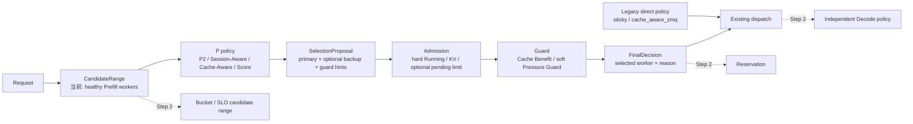

# Router Policy Step 1 集成与实现计划

日期：2026-08-04
状态：代码实现完成；Rust toolchain 验证待环境恢复
分支：`codex/router-policy-integration`

> **For Codex:** 按 `superpowers:executing-plans` 逐项执行；每个行为先写
> 失败测试，再写最小实现。

**目标：** 在同构 Prefill 集群中，把 `power_of_two`、`session_aware`、
`cache_aware`、`score_policy` 接入同一条 `proposal → admission → guard → dispatch` 路径；为
未来 Bucket、SLO 和 Reservation 保留候选域与最终决策接口，但本阶段不实现
Bucket。

**架构：** Policy 只从 Router 给定的候选域提出 `primary + backup`。共享
Admission 做容量硬筛选，Guard 在已准入的两个候选之间处理缓存收益和压力逃逸。
只有最终 worker 才交给既有 dispatch；policy 不做同步 RPC、预扣或副作用。

**技术基础：** Rust、现有 `WorkerRegistry`/`PdPoolResolver`、#32927 的
`LoadMonitorSnapshot`、#33370 在 ingress 异步准备的 `ExternalPrefixSignal`。

---

## 约束与不变量

- 进入共享硬 Admission 的顶层 policy：`power_of_two`、`session_aware`、
  `cache_aware`、`score_policy`；Score 没有 affinity backup 或软 Guard。
- `sticky` 与 `cache_aware_zmq` 不 opt-in 共享 Admission / Guard，因而保留现有
  primary 直接 dispatch 的行为。新 policy 也必须显式 opt-in。
- #32629 的 eligibility `Pipeline` 若包裹了上述任一 policy，会把已过滤候选域
  上的 proposal、fallback 候选与 opt-in 标识转发给 inner policy；共享
  Admission fallback 不能重新引入已被 Filter 排除的 worker。
- 每个请求只选一种 affinity policy；Session-Aware 和 Cache-Aware 不叠加。
- 当前候选域固定为健康、模型兼容的 Prefill worker，即 `CandidateRange::global`。
  PD 场景先由现有 `PdPoolResolver` 给出 P 候选；本阶段不改变 D 的选择逻辑。
- Indexer 只提供 ingress 已完成的 advisory 信号；policy 热路径禁止发 RPC。
- `LoadMonitor` 缺失或过期时不得把健康 worker 全部拒绝；回退到本地 P2 /
  active-load 排序。
- `gen_throughput` 是 decode 生成吞吐，不能伪造为 prefill rate 或 queue ms。
- 不实现 Bucket、TTFT/ITL、Reservation、预扣、speculative dispatch 或
  P-D 全局联合搜索。

## 目标数据流



## 统一候选域与决策接口

```text
CandidateRange {
  id: "global",                       # Step 2 改为 bucket_id
  workers: healthy_prefill_workers,
  max_pending_prefill_tokens: None,    # Step 2 的 Bucket 限制
}

SelectionProposal {
  primary,
  backup?,
  eligible_workers?,                   # Filter 后的 hard fallback 范围
  kind: P2 | SessionAffinity | CacheAffinity | Score,
  guard_hints,
}

FinalDecision {
  selected,
  primary,
  backup?,
  reason,
}
```

Bucket 未来只能通过替换 `CandidateRange` 的 `id`、worker 集和可选 pending
上限接入。它不能在全局打分之后再“修正”结果，因此现有 policy 与 Guard 无需
重写。

## Policy 行为

### Power of Two

在候选域随机采样两个不同 worker，按共享压力比较器排序为 `primary`、`backup`。
当前监控可可靠比较的顺序是（P2、Cache 命中并列选择与 Admission fallback 共用）：

```text
两者都有 fresh LoadMonitor snapshot:
  waiting uncached tokens → waiting reqs → running reqs → local active load
否则：
  local active load
```

P2 的 backup 不是投机发送对象；只在 primary admission 失败时，或未来的公共
决策逻辑明确选择它时使用。

### Session-Aware

- 从可配置 header 读取 Session-ID。
- 已存在且仍在候选域中的 assignment 是 affinity primary。
- 新 Session 或旧 assignment 已不健康时，用候选域 P2 选 primary；仅后者会
  更新 SessionMap。
- 有 affinity primary 时，backup 由 `stable_pair` 或候选域 P2 产生：
  - `stable_pair=true`：`hash(session_id, candidate_range_id)` 在
    `workers - primary` 上确定性选择；
  - 否则：P2 从 `workers - primary` 采样。
- Guard 的软逃逸不会改写 SessionMap；只有 worker 离开候选域才 remap。
- SessionMap 记录 `last_seen`，默认闲置 600 秒后由后台 sweeper 回收；
  `--session-idle-secs` 与 `--session-eviction-interval-secs` 可调整该边界。

### Cache-Aware

- 只读取 `ExternalPrefixSignal`，与当前候选域求交。
- 选择最长 prefix holder；并列时按共享压力比较器选 primary。
- 缓存未命中、indexer 结果为空、或所有 holder 不在候选域时，退化为候选域 P2。
- 有 cache affinity primary 时按与 Session 相同的 stable/P2 规则产生 backup。
- 用 `input_tokens * matched_prefix_blocks / query_blocks` 保守估算
  `matched_prefix_tokens`，仅作为 Cache Benefit 的 hint；无 external match
  时不启用该 gate。

`cache_aware_zmq` 与旧 `sticky` 原样保留；这次不改变它们的语义。

## Admission（硬）与 Guard（软）

### Admission

先检查 proposal 的 primary/backup；snapshot fresh 时，worker 必须满足：

```text
num_running_reqs + 1 <= max_running_requests
num_total_tokens + request_input_tokens <= max_total_num_tokens
可选 Bucket pending 限制：
  num_waiting_uncached_tokens + request_input_tokens <= max_pending_prefill_tokens
```

KV 判断使用 `num_total_tokens`，不再额外扣减可 eviction 的 prefix cache。
若两个 proposal 候选都未准入，才在当前候选域扫描可准入 worker，并用共享压力
比较器挑最低压力者；无 fresh monitor 时不做 capacity hard reject。

### Guard

Guard 只在 primary 与 backup 都通过 Admission 后执行：

1. Cache-Aware 的 `Cache Benefit` 可选开启。若
   `matched_prefix_tokens <= input_tokens - matched_prefix_tokens`，缓存复用收益
   不足，选择 backup。
2. `Pressure Guard` 只在 `affinity_mode=soft` 且两者都有 fresh snapshot 时启用。
   若 primary 的 `num_waiting_uncached_tokens` 同时超过 backup 的绝对差和相对差
   阈值，选择 backup。
3. `affinity_mode=strict` 不允许 Pressure Guard 逃逸；只要 primary 通过
   Admission 就保留 primary。

一旦 Cache Benefit 或 Pressure Guard 选择 backup，后续 gate 必须短路。

## 实现任务（按 TDD 顺序）

### Task 1：定义 proposal / 候选域 / Admission-Guard 的纯逻辑

**文件：**

- 修改：`src/policies/mod.rs`
- 新增：`src/policies/admission.rs`

**步骤：**

1. 在 `admission.rs` 写失败测试：P2 primary admission 失败转 backup；两者都
   不通过时扫描 CandidateRange；soft pressure 与 cache benefit 仅在两者 admission
   成功后才选 backup。
2. 运行定向 Rust test，确认因模块/接口不存在失败。
3. 定义 `CandidateRange`、`SelectionProposal` guard hints、`FinalDecision` 与
   可注入 snapshot 的 `resolve_prefill`。
4. 重新运行定向 Rust test；最终运行 `cargo fmt --check`。

### Task 2：让 P2 与 Session-Aware 产生稳定 pair

**文件：**

- 修改：`src/policies/power_of_two.rs`、`src/policies/mod.rs`
- 新增：`src/policies/session_aware.rs`

**步骤：**

1. 写失败测试：P2 proposal 有两个不同候选；Session map 的 hit 保持 primary；
   soft backup 不 remap；stable pair 对同一 session/range 可复现。
2. 运行定向 test，确认失败。
3. 以最小实现覆盖 proposal 与 map 行为。
4. 运行定向 Rust test 与 formatter。

### Task 3：接入 Cache-Aware、配置与 factory

**文件：**

- 修改：`src/config/types.rs`、`src/config/cli.rs`、`src/policies/factory.rs`
- 新增：`src/policies/cache_aware.rs`

**步骤：**

1. 写失败测试：CLI 接受新 policy 和 affinity knobs；外部最长 prefix holder
   成为 primary；cache miss 退化为 P2；非当前候选域 holder 不可选择。
2. 运行定向 test，确认失败。
3. 实现 `AffinityConfig`、factory 分支和 Cache-Aware proposal。
4. 运行定向 Rust test、`cargo fmt --check`。

### Task 4：把共享层接到 ingress

**文件：**

- 修改：`src/server/app_context.rs`、`src/main.rs`、`src/server/routes/chat.rs`

**步骤：**

1. 写/扩展 route-level test：dispatch 使用 `FinalDecision.selected`，而不是
   proposal primary；disabled/stale monitor 不硬拒绝健康 worker。
2. 运行定向 test，确认失败。
3. 将 `LoadMonitor` 放入 `AppContext`，在 chat route 构造 global range；对明确
   opt-in 的 Step 1 policy 执行 `proposal → admission → guard → dispatch`。
4. 运行定向 Rust test、全量可用测试和 `git diff --check`。

### Task 5：文档与收尾审计

**文件：**

- 修改：本文件、`README.md`

**步骤：**

1. 记录实际 CLI 默认值、明确 `score_policy` 只是并列 policy。
2. 核对没有改变 `sticky` / `cache_aware_zmq` 行为。
3. 运行 `cargo fmt --check`、`cargo test`、`git diff --check`；若本机缺少 Rust
   toolchain，保存准确失败原因，不把未执行写成通过。
4. 设置并复核指定 git identity 后，用 `--amend` 合并本地未推送的基线提交；
   不 push。

## 未来 Step 2

Step 2 增加 Bucket/SLO 时，流程只演进为：

```text
request shape + SLO → CandidateRange(bucket_id, workers, limits)
→ unchanged P policy → unchanged Admission → unchanged Guard → FinalDecision
```

Decode policy、TTFT/ITL profile、rank/fallback、P-D transfer-aware 选择和
Reservation 都在此接口之上单独添加，不能反向把 Bucket 或 SLO 逻辑塞入现有
P2 / Session / Cache policy。
