# SGLang Router Policy：Step 1 / Step 2 方案设计

日期：2026-08-04
状态：v2 集成分支实现设计；Step 1 是同构集群的 Policy / Admission / Guard 共设计，Step 2 在同一骨架上增加 work-aware Bucket 与 SLO。
范围：`experimental/sgl-router`

> LoadMonitor 原始指标、Router 派生指标及其在 Guard/Policy 中的精确消费属于独立的
> [Step 3](router-policy-step3-load-monitor-design.md)，不改变本文 Step 1/Step 2 的调度层次。

> 本文是 Router Policy 的唯一目标设计来源。它替换“先按完整 prompt 长度选择
> Prefill Bucket、再把 Cache 当作跨 Bucket 例外”的旧顺序。新的 Cache-Aware
> 语义是：**先用 Indexer 的真实 prefix match 构造少量全局 cache candidates；全部
> 不可用时，才进入 no-hit Bucket fallback。**
>
> 当前分支已经实现：Indexer 有界候选、粗粒度 `H/E`、逐候选 Admission、候选锦标赛、
> 单 winner 以及静态 Bucket fallback。精确 token match、受限 Indexer response、
> Reservation 和 Transfer-Aware Decode 仍是后续增量。

## 1. 目标与关键决策

Router 不把 Bucket、Cache、Session 和负载揉成一个总控 policy，而是保持分层：

1. **请求事实与硬兼容性**：完整输入、模型、Runtime、上下文和 SLO 能力；
2. **顶层 Policy**：`power_of_two`、`session_aware`、`cache_aware`、`score_policy`；
3. **候选决策**：对候选逐个执行 Admission，并以 Policy 定义的比较规则选 primary；
4. **Guard**：只处理候选间的软压力/收益判断，不能绕过 Admission；
5. **Bucket Resolver**：只在 no-hit Cache fallback 或非 Cache policy 路径构造有序
   Runtime 候选域；
6. **既有 dispatch**：消费 Final P / D；Reservation 是后续接入点。

本设计固定以下结论：

- `session_aware` 与 `cache_aware` 是互斥顶层 policy；Session-ID 不被当作真实 cache
  hit 的证据。
- Cache-Aware 只有一种固定的 **global work-first** 路径：先做一次有界 Indexer
  prefix-match 查询，而不是先用完整 prompt 长度把请求锁进一个 Prefill Bucket。
- 全量输入长度 `L` 与目标相关的未命中 Prefill 工作 `E_i` 必须分开：

  ```text
  L   = total_input_tokens
  H_i = target worker i 可复用的连续 prefix tokens
  E_i = L - H_i
  ```

  `L` 决定 worker 能否承载完整请求；`E_i` 决定这次实际新增的 Prefill work。
- Router 不查询每个 worker 的 cache。它只处理 Indexer 返回的 cache-hit workers；不在
  返回列表中的 worker 统一视为 `H=0, E=L`，构成 no-hit fallback。
- Cache-Aware 的 Top-K 候选通过逐个 Admission 与两两比较选出最终 winner；不是先选
  一个 cache winner，再拿一个任意 backup 做唯一一次比较。
- 所有 cache candidate 都失败，才用 `E=L` 做普通 Prefill Bucket 选择，在 Bucket 内
  使用 P2 / Load-Aware、Admission 和 Guard。
- `sticky` 与旧 `cache_aware_zmq` 保持原有行为；`score_policy` 是独立软评分 policy，
  不能承担 Bucket、SLO、Cache 或 P/D 联动总控。

```mermaid
flowchart LR
    R["Request"] --> F["Request Facts\nL / request tokens / Session / SLO"]
    F --> Q{"policy = cache_aware?"}

    Q -->|yes| I["one bounded Indexer\nprefix-match query"]
    I --> C["Cache candidates\nworker_i + H_i + E_i"]
    C --> A["hard compatibility\n+ per-candidate Admission"]
    A --> T["bounded pairwise tournament\nbenefit + pressure"]
    T -->|winner exists| P["Final P"]
    T -->|none survives| NF["No-hit fallback\nE = L"]

    Q -->|no| BR["Bucket / Global Resolver"]
    NF --> BR
    BR --> PP["P2 / Session / Score policy"]
    PP --> PA["P Admission + Guard"]
    PA --> P

    P --> DR["PD only: Decode Resolver"]
    DR --> DP["Decode policy\n+ D Admission / Guard"]
    DP --> D["Final D"]
    P --> X["existing dispatch"]
    D --> X
```



## 2. 请求量、cache 量与安全边界

### 2.1 两个不可混用的量

| 量 | 含义 | 使用位置 |
|---|---|---|
| `L` | 请求的完整输入 token 数 | 模型/Runtime、`max_context`、完整 sequence 约束、保守 KV 容量判断 |
| `H_i` | worker `i` 已持有的连续可复用 prefix token 数 | cache candidate gate 与排序 |
| `E_i=L-H_i` | worker `i` 还需要新增计算的 Prefill token 数 | Prefill work profile、待处理 Prefill 压力、queue/execution 成本估计 |

Bucket 启用后，ingress 对 P2/Session-Aware 同样请求模型 tokenizer 的 token 数；带可用
chat template 时它对应完整渲染 prompt。模型无法在 Router 侧渲染/分词时才退化到 raw
prompt 或 JSON 字节估算，因此该降级值只能作为 Bucket/容量近似，不能宣称是引擎
实际 token 数；真正的 Runtime context 上限仍由 worker 最终校验。

示例：

```text
request: L = 500k

normal worker:
  H = 495k
  E = 5k
  max_context >= 500k
  → 可优先处理；它需要承载 500k context，但仅新增约 5k Prefill work

long worker:
  H = 0
  E = 500k
  → no-hit fallback
```

`E_i` 不能替代 `L` 做所有判断。Indexer 是 advisory，worker cache 可能在 Indexer
更新后被 eviction 或重启。因此第一阶段的 Router KV capacity admission 仍保守使用
`L`；`E_i` 先用于 Prefill work、pending admission 和候选比较。只有有了
target-specific KV reservation / `new_kv_blocks` 反馈后，才能让硬 KV guard 安全地按增量
KV 成本放宽。

### 2.2 当前 Indexer 能提供的证据

`MatchExternalKvPrefix` 现已返回：

```text
matches = [
  { worker_address, worker_id, matched_prefix_blocks },
  ...
]
```

其顺序是 `matched_prefix_blocks` 降序；每项描述某 worker 从请求第一个 block 开始的
连续可复用 prefix。它不是 worker 的总 cache 容量，也不包含 Router 所需的健康、P/D
pool、模型版本、SLO 或实时压力结论。

当前限制必须显式保留：

- 返回的是 block 数；现阶段 `H_i` 只能由 `matched_prefix_blocks` 和请求 token/block
  信息做保守近似；
- Redis backend 有 prefix scan cap；被截断的长请求只得到命中下界，不能把它解释为
  实际命中上限；
- 当前 RPC 没有 `max_matches`，热点 prefix 可返回很多 holder；Router 可以本地限制
  尝试次数，但不能完全消除 Indexer 的内部聚合成本；
- Indexer 查询超时、不可达、空结果或不可信时统一降级为无 cache signal，不阻塞推理。
- Router 只有在 worker KV-event metadata 已建立一致 block-size oracle 后才能生成同构
  block hash；oracle 未就绪时不会猜测 block size，也不会发出错误查询，而是直接走
  no-signal fallback。

## 3. 公共接口与候选决策

### 3.1 CandidateDomain 与 Bucket profile

`CandidateDomain` 仍是 Policy 的 worker 范围和 admission limit 载体。无 Bucket 的同构
集群只有 GlobalDomain；Bucket 启用后，no-hit fallback 及非 Cache 路径由 Bucket Resolver
生成有序 Domain。

```rust
enum RoutingStage {
    Prefill,
    Decode,
}

enum CandidateDomainId {
    Global { stage: RoutingStage },
    Bucket { stage: RoutingStage, bucket_id: String },
}

struct CandidateDomain {
    id: CandidateDomainId,
    stage: RoutingStage,
    workers: Arc<[Arc<Worker>]>,
    admission: DomainAdmissionLimits,
    profile: RuntimeProfile,
}
```

Cache candidate 不要求先属于由 `L` 选中的 target Bucket。它必须满足自己所属
Bucket/Runtime 的完整 `L`、SLO 和健康约束；通过后，该 Bucket profile 用于解释其
`E_i` Prefill work。

### 3.2 两种有界候选提案

P2 / Session 的天然形态是 two choices；Cache-Aware 的天然形态是 Top-K。目标接口应
允许二者共存，而不是强迫 Cache-Aware 丢掉第 2 到第 K 个有价值的 match：

```rust
enum PrefillProposal {
    Pair(SelectionProposal),
    CacheCandidates(CacheCandidateProposal),
}

struct CacheCandidate {
    worker: Arc<Worker>,
    matched_prefix_tokens: u64, // H_i
    uncached_tokens: u64,       // E_i
    candidate_range_id: String,
    max_pending_prefill_tokens: Option<u64>,
}
```

```text
P2 / Session:
  candidates = primary + optional stable/P2 backup

Cache-Aware:
  candidates = bounded Top-K cache candidates
  no-hit Bucket fallback 不混入该列表
```

`PrefillProposal` 仅表达“谁可被比较”，不绕过 Router 的 Admission。未来 policy
贡献者可以复用 pair，也可以增加新的有界 proposal；Bucket、LoadMonitor、dispatch 和
Reservation 不复制到各 policy 内。

### 3.3 P、D 与最终结果

```rust
struct FinalDecision {
    selected: Arc<Worker>,
    primary: Arc<Worker>,
    backup: Option<Arc<Worker>>, // Cache winner 恒为 None
    candidate_range_id: String,
    reason: DecisionReason,
}
```

Cache tournament 的结果就是 Final P，不保留策略 backup。Session/P2 pair 仍可在
Admission/Pressure Guard 中使用 backup。当前发送失败沿用 Router 的错误与 circuit-breaker
处理，不执行同请求重选，也不重新定义为 Cache policy backup。未来通用 retry 与
Reservation 都应接在 FinalDecision 与 Dispatch 之间，而不是嵌入具体 policy。

Session-Aware 的 assignment commit 位于 `FinalDecision` 之后：新 session 的 P2 proposal
不会提前写 SessionMap，只有最终通过 Admission/Guard 的 worker 被记录。既有 affinity
primary 的本轮 Admission/Guard 逃逸不回写；外层 EligibilityFilter 的瞬时拒绝同样不能
永久迁移 assignment。这一 hook 只提交 policy 状态，不是发送成功回调或 Reservation。

## 4. Cache-Aware：固定的全局 Top-K tournament

### 4.1 入口与 candidate gate

只有 `policy=cache_aware` 且请求可得到 routing token / block hashes 时，Ingress 才发起
一次受 deadline 约束的 Indexer prefix-match RPC。P2 和纯 Session-Aware 请求不因此增加
Indexer RPC。

Indexer 返回后，Router 对每个 match 先做下列过滤：

```text
1. worker 仍在 Registry，健康，属于当前 Prefill pool；
2. 模型 / revision / Runtime 兼容；
3. worker 自己所属 profile 的 max_context >= L；
4. 若开启 Hard TTFT：该 worker 自己所属 Bucket 的 profile 满足请求 SLO；
5. match 的 H_i 与 H_i / L 满足 Cache candidate gate。
```

Cache candidate gate 使用两个独立、可关闭的下限：

```text
cache_affinity_min_matched_tokens: Option<u64> # 默认 1024
cache_affinity_min_match_ratio: Option<f64>    # 默认 None；按需启用
kv_indexer_query_timeout_ms: u64               # 默认 25ms
```

语义保持简单、可预测：已配置的下限都必须满足；`matched_tokens` 未配置时不参与判断，
默认用绝对下限过滤极小命中，比例 gate 保持可选。原因是 Indexer 可以对单次
prefix scan 做服务端截断；若默认以完整输入 `L` 计算 50% 比例，长 prompt 即使
返回了很大的可靠命中下界，也可能被错误拒绝。两个 gate 同时配置时仍取 AND。
Indexer 查询有独立硬 deadline；超时只产生 `NoSignal` 并进入 P2 fallback，
不会使推理请求失败。

```text
eligible(match_i) =
  (min_matched_tokens 未配置 或 H_i >= min_matched_tokens)
  AND
  (min_match_ratio 未配置 或 H_i / L >= min_match_ratio)
```

这样运营者可只用其中一个门槛，也可同时要求“绝对节省量足够大且命中比例足够高”。
当前 block-to-token 近似和 scan cap 只能给出保守下界；在缺少可靠 `scan_capped` / token
信息时，不能用低估的 ratio 证明一个长请求“真实命中不足”。第一版应把此类结果当成
保守信号，或用更明确的 Indexer 截断标志降级。

### 4.2 Top-K 是有界混合值

Top-K 不用固定 `4/8`，也不能只用 P pool 百分比。定义：

```text
N = 当前健康且模型兼容的 Prefill worker 数

K_attempt = min(N, K_max, max(K_min, ceil(candidate_ratio * N)))
```

推荐将 `K_min`、`candidate_ratio`、`K_max` 都配置化。示例而非冻结默认值：

```text
K_min = 8
candidate_ratio = 0.05
K_max = 32
```

小集群会覆盖全部 P；中大型集群随规模温和扩大；超大集群保持 Router 热路径上界。
Indexer 未来还应支持 `K_fetch`（通常是 `2~4 × K_attempt`，有独立上限），以补偿
Router 过滤掉不健康/不兼容 match 后的候选损失。当前 base Indexer 返回所有正 match 时，
Router 仅在本地保留最多 `K_attempt` 个可尝试候选。

若多个 worker 的 `matched_prefix_blocks` 相同，不能机械截取 response 中的前 K 项；
它们具有相同 cache benefit。当前实现先比较 fresh Prefill pressure，再比较候选阶段
一次性捕获的 Router local active load，最后才用稳定 worker id 打破完全平局；Top-K
使用 selection partition 后只排序保留的 K 项，并为本请求构造 O(1) load lookup，避免
排序过程中读取变化中的原子计数。后续若实测等命中 replica 在 snapshot 周期内仍形成
热点，可在同一接口内增加稳定 hash/P2 采样，而不是扩大为全量查询。

### 4.3 逐个 Admission、全局近似区间内比较

Cache candidate 的正确选择不是“第一名是 primary、再找一个任意 backup”，而是有界
tournament：

```text
admitted = []

for candidate in bounded_cache_candidates:
    过滤 gate / hard compatibility 未通过者

    对 candidate 执行 Prefill Admission
    Admission 未通过：继续下一个 candidate
    admitted 追加 candidate

admitted 为空：进入 no-hit Bucket fallback

E_floor = min(candidate.E for candidate in admitted)
near_tie_candidates = admitted 中满足
                      E <= E_floor + cache_switch_margin_tokens 的候选

winner = E 最小的候选
for candidate in near_tie_candidates:
    对 candidate 与 winner 执行 CandidateComparator
    candidate 更优：candidate 替换 winner

winner 就是 Final P，不再生成 backup
```

这里的“无 backup”也适用于当前 dispatch：本版本不持有 Cache 次优候选做同请求重试，
发送失败继续使用 Router 既有错误/circuit-breaker 语义。未来若引入通用 retry，应重新
进入 selection 或使用独立 retry hook，不能悄悄恢复旧的 Cache primary/backup 二选一。

Comparator 的语义：

```text
1. 以所有 admitted candidate 的最小 E 为全局基线；
2. 超过 `E_floor + cache_switch_margin_tokens` 的候选不进入压力比较；
3. 全局近似区间内，显著更高的 Prefill pressure 可以否决较小的 cache gain；
4. 未达到压力绝对差与相对差阈值时，仍选 E 更小者；
5. 仍平局时使用共享压力顺序和稳定 worker id。
```

全局基线是必要的：若只比较相邻候选，`E=0 → 20 → 40` 可能通过两次各自在
32-token margin 内的压力切换，最终累计选到已经超过最小 E 一个 margin 的候选。
锚定 `E_floor` 后仍允许一次合理的近似收益负载逃逸，但不会发生这种链式漂移。

因此 Guard 在 Cache path 中不再是“仅比较一个预先选定 backup 的最后开关”，而是
CandidateComparator 的 pressure/benefit 维度。Admission 始终先于比较；Guard 不能把
Admission 已拒绝的 worker 选回。

`cache_switch_margin_tokens` 防止微小 cache 差异破坏负载均衡：

```text
A: E=5k，压力高
B: E=6k，压力低
→ 1k 差异不应强制选 A

A: E=5k，B: E=200k
→ A 的 cache benefit 显著，只要 Admission 通过就优先 A；压力不能抹掉大收益
```

### 4.4 no-hit fallback

只有 Top-K cache candidates 全部未通过 gate、硬兼容性或 Admission 时，才执行：

```text
H = 0
E = L
→ Prefill Bucket Resolver
→ 有序 CandidateDomain
→ P2 / Load-Aware proposal
→ Admission
→ Guard
→ Final P
```

no-hit fallback 不与 cache candidate tournament 混合。这样“一个满足 cache gate 且
Admission 通过的高价值 cache holder”不会因为普通 no-hit P2 worker 更空闲而被过早
放弃；Cache candidate 间的压力平衡已经在 tournament 中处理。

## 5. Session、P2 与 Score policy

### 5.1 Session-Aware

Session-ID 只表达粘性，不证明当前 worker 存在当前请求的 KV prefix。因此：

```text
Session primary:
  使用 SessionMap 的 assignment；未命中时 P2 建立 assignment

Session work:
  无可信 target cache hint 时保守取 E=L

Session escape:
  strict / soft 仍只影响压力逃逸，不把 Session-ID 伪造成 cache hit
```

Session 的模式配置可为 `bucket | global-rebind | global-preserve`。Cache-Aware 不暴露该
mode：始终执行一次全局有界 Indexer candidate path，失败后进入 normal Bucket/Global
P2。二者不在同一请求叠加。

`global-preserve` 的首次请求仍需由 target Bucket 的 P2 建立全局 Session assignment；之后若
已有 global primary 仅因自身 Bucket/SLO/Admission 不可用而失败，target fallback 不会
重写该 assignment。无 Bucket 配置时三个模式都退化为同一个 GlobalDomain，并保持正常
的首次 assignment 与后续复用。

### 5.2 Power-of-Two 与 Score policy

- `power_of_two`：当前 Domain 内采样两个候选、按共享 Prefill pressure 排序；
- `score_policy`：独立软评分 policy，可在已给定 Domain 内排序，不承担 Cache
  candidate tournament、Bucket fallback、SLO 或 P/D 总控；
- `sticky`、`cache_aware_zmq`：保持既有 direct-dispatch 语义，除非显式选择迁移到
  新候选接口。

## 6. Prefill Bucket、TTFT 与 rank

### 6.1 Bucket 的静态含义

Bucket 代表静态 runtime/profile/capacity 能力；worker 的 health、queue、running 和
KV 状态是动态状态。

```text
BucketSpec {
  bucket_id,
  stage: Prefill | Decode,
  rank,                         # 唯一、越小越优先
  worker_selector,
  runtime_profile,
  max_context_tokens,           # 完整 L 的硬上限
  min_extend_tokens?,
  max_extend_tokens?,           # Prefill 新增工作 E 的适配范围
  ttft_p95_at_capacity_ms?,
  tps_p05_at_capacity?,
  admission_limits,
}
```

`max_context_tokens` 和 `min/max_extend_tokens` 必须分开：前者确保 worker 可承载完整
请求，后者表达该 runtime 适合处理多大的新增 Prefill work。no-hit 路径中 `E=L`，因此
仍用完整输入长度选择 extend-work Bucket；cache path 则对每个 target 使用自己的 `E_i`。

### 6.2 Cache path 与 Bucket

Cache path 中，每个候选使用**其自身所属 Bucket** 的 profile：

```text
worker i：
  检查 i 的 Bucket 是否满足 L、Runtime 和 SLO
  以 E_i 解释 i 的 Prefill work / pressure
  不要求 i 属于 no-hit 路径按 E=L 选择的 target Bucket
```

这允许“500k 完整 context、99% 命中、5k extend work”的 normal runtime worker 被保留，
前提是其 `max_context_tokens >= 500k`。

### 6.3 no-hit Bucket 与 SLO fallback

无 cache signal 或 cache candidate 全失败时，才以 `E=L` 选择 Prefill work Bucket。
Bucket Resolver 先做完整请求的硬兼容性，再按 SLO policy 和唯一 `rank` 给出有序 Domain：

```text
ttft_slo_policy = disabled | best_effort | slo_first

disabled:
  兼容 Bucket 按 rank

best_effort:
  先按 rank 尝试不满足本请求 SLO 的低成本 Bucket
  这些 Bucket 全部失败后，再按 rank 尝试满足 SLO 的保底 Bucket

slo_first:
  先尝试满足 bucket.ttft_p95_at_capacity_ms <= request.ttft_slo_ms 的 Bucket
  eligible Bucket 全部 Admission 失败后，再按 rank 尝试其余兼容 Bucket
```

每次换 Bucket 都从该 Bucket 的 P2 / Policy proposal、Admission 和 Guard 重新开始；不复用
上一 Bucket 的 primary、backup 或压力比较结果。

配置启动校验要求至少存在一个 Prefill Bucket；每个 worker 在同一 stage 只能属于一个
Bucket，rank 在同一 stage 唯一。Prefill 只能配置 extend/TTFT/pending 字段，Decode 只能
配置 sequence/TPS 字段；跨 stage 的无效字段直接报错，避免静默忽略。仅配置 Prefill
Bucket 时，Decode 保持 Step 1 的全局候选域；配置任意 Decode Bucket 后才启用 Decode
Bucket 解析，此后没有兼容域就是明确的路由失败，不再回退到全局 Decode 域。

## 7. Admission、LoadMonitor 与 Guard

Prefill candidate 的处理顺序固定：

```text
candidate
→ full-context / SLO hard compatibility
→ P Admission
→ Cache tournament comparator 或普通 P Guard
→ Final P
```

当前可用 LoadMonitor 输入：

```text
num_running_reqs
max_running_requests
num_waiting_reqs
num_waiting_uncached_tokens
num_total_tokens
max_total_num_tokens
num_active_tokens
decode_prealloc_queue_reqs
decode_transfer_queue_reqs
decode_retracted_queue_reqs
estimated_prefill_queue_ms（由同源连续 counter 派生）
mean_decode_step_ms（由同源连续 counter 派生）
```

Router 按实际消费者懒捕获 snapshot：共享 Prefill policy 一次捕获后贯穿 proposal、
Admission 和 Guard；plain legacy policy 不付出全量 snapshot 克隆成本。PD 请求若在 P
阶段没有消费者，则只在 Final P 后为 Decode 捕获一次。

第一阶段的 Router Admission 保持保守：

```text
num_running_reqs + 1 <= max_running_requests
num_total_tokens + L <= max_total_num_tokens

Cache candidate 的可选 pending limit：
num_waiting_uncached_tokens + E_i <= max_pending_prefill_tokens

P2 / Session / no-hit fallback 的可选 pending limit：
num_waiting_uncached_tokens + L <= max_pending_prefill_tokens
```

Indexer 的 prefix match 已足以把 `E_i` 用于 Prefill work 与 pending projection；硬 KV
容量仍以 `L` 保守投影。只有 target-specific KV allocation / Reservation 反馈成熟后，硬
KV guard 才能安全地按增量放宽。Step 3 使用真实 Prefill 累计 counter 派生
`estimated_prefill_queue_ms`；不可派生时只使用所有候选共同具有且 fresh 的
waiting/running/local active-load 层级，不使用 decode throughput 伪造 Prefill rate。

## 8. Decode、TPS 与 PD 边界

Cache-aware Prefill 改动不改变 P/D 解耦原则：Final P 后，PD Router 独立选择 D。

```text
Final P
→ Decode Bucket Resolver（仅 PD）
→ Decode policy
→ D Admission
→ D Guard
→ Final D
```

Decode 的静态基础 Bucket 仍按完整 sequence 能力：

```text
expected_peak_sequence_tokens = L + requested_max_output_tokens
```

TPS 是可选 SLO 能力层：

```text
tps_slo_policy = disabled | best_effort | slo_first
```

`max_running_requests`、KV capacity、动态 queue 和 P2 决定 Bucket 内的 D admission /
pressure；它们不替代离线 profile 的 TPS capability。Transfer-Aware D 比较要等
`estimated_transfer_ms(P,D,request)`、decode queue 与 decode step 指标可信后再加入；
不在当前 Router 中伪造成本。

## 9. Indexer 增量与分阶段实施

### Step 1：同构 Policy / Load co-design（本分支实现）

目标：不要求 Bucket，也不改变既有 dispatch。

```text
GlobalDomain
→ P2 / Session / Cache / Score
→ per-candidate Admission
→ Guard / FinalDecision
```

Cache-Aware 可先消费当前 Indexer 的有序 block match 列表，做 bounded local Top-K
tournament；`H_i` 采用保守近似。无 Indexer signal 时退化为 GlobalDomain P2，不失败。

### Step 2：静态 work-aware Prefill Bucket 与 SLO（本分支实现）

目标：引入本文第 6 章的 `max_context_tokens + extend range`、rank、TTFT policy 与
ordered Bucket fallback。

```text
Cache signal exists:
  global cache candidate tournament

No cache signal / all candidates fail:
  E=L → work-aware Prefill Bucket → P2 / Admission / Guard
```

### Step 2.1：Indexer 契约增强（后续）

为生产级长 prompt 与热点 replica 补充兼容性扩展：

```text
request.max_matches
response.matched_prefix_tokens（可复用 token 的安全下界）
response.scan_capped（明确 prefix scan 是否被上限截断）
```

这首先限制 wire / Router 开销；若热点 prefix holder 规模证明 Redis backend 的内部
聚合成本过高，再增加两段式查询或后端 Top-K/refine 优化。不要在 Router 热路径中
改为逐 worker cache 查询。

### Step 3：LoadMonitor 指标接入（当前增量）

Step 3 不增加新 policy 或 Bucket mode，只补齐 Scheduler → Reporter → Router →
Policy/Guard 的指标链路：

```text
Prefill cumulative counters → estimated_prefill_queue_ms
Decode queues + cumulative step counters + active tokens → Decode pressure
```

字段、比较顺序和滚动升级降级规则见
[Step 3 LoadMonitor 指标接入](router-policy-step3-load-monitor-design.md)。

### 后续：Reservation

Reservation 需要单独定义 P/D 的预扣单位、取消/超时/发送失败归还和与 LoadSnapshot
的合并规则。当前 proposal → final decision → dispatch 的边界允许后续插入 optional
Reservation hook；不在 policy 中实现投机发送或 `SpeculativeBackup`。

## 10. 可观测性、验收与非目标

当前实现已记录低基数 policy/reason counter，并在 debug decision log 中记录最终 worker、
candidate range、snapshot version；Cache winner 额外记录候选数及 `L/H/E`。完整 E2E
analyzer 继续从 Router/worker 指标计算 RT、TTFT、TPS、KV hit rate、worker CV 与 reason。

下面这些是后续可观测性增量，不应解释为当前已存在的字段：

```text
policy
Indexer signal status / age
matched candidates count
bounded candidate count K
selected worker / selected bucket
L, selected H_i, selected E_i
Admission reject reason
comparison reason（cache benefit / pressure / tie-break）
fallback reason
snapshot freshness / load level
```

其中 Indexer age、逐候选 Admission reject reason、comparison reason 和显式
`slo_degraded` 尚未实现；它们应在不增加请求维度 label 的前提下补入日志或闭集 counter。

验收重点：

- `500k` 请求在一个 worker 可复用约 `495k` prefix、另一 worker 无命中时，只要前者
  的完整 context、SLO 和 Admission 通过，必须优先选前者；
- Top-K 中第一候选 Admission 失败时，后续可用 cache candidate 必须被尝试；
- 多个 Admission 通过的 cache candidate 必须经过 tournament，而不是固定保留 Indexer
  response 第一项；
- 所有 cache candidate 失败才进入 no-hit Bucket；无 cache signal 不能让请求失败；
- Session-ID 不得被用作伪造 `H_i`；
- Router 参与 Admission 与 tournament 的 cache candidate 数受配置化 Top-K 上界 `K` 约束；
- 同构无 Bucket / 无 SLO 时仍退化为 GlobalDomain P2，不做静态容量硬切分；
- Indexer 超时、snapshot stale、worker 不健康、请求取消或发送失败均有明确降级与计数
  归还路径。

非目标：

- 不把 Session-Aware 和 Cache-Aware 叠加为单请求组合 policy；
- 不把 `score_policy` 变成 Bucket/SLO/PD 总控策略；
- 不把 block match 近似当作精确 KV reservation；
- 不在 Router 热路径扫描所有 worker 的 cache 或向每个 worker 同步查询；
- 不用 decode throughput 伪造 Prefill queue；不在缺少 transfer 成本指标时实现伪
  Transfer-Aware D，也不实现投机 dispatch。
