# SGLang Router Policy：Step 1 与 Step 2 方案设计

日期：2026-08-04
状态：设计冻结，按 Step 1 实现前的正式方案
范围：`experimental/sgl-router`

## 1. 目标与原则

Router 的最终结构不是把 Bucket、缓存亲和性和负载评分揉成一个 policy，而是分层：

1. **CandidateDomain** 决定本请求允许使用的 Runtime / endpoint 候选域；
2. **Policy** 在候选域内提出 `primary + optional backup`；
3. **Admission** 用硬容量约束筛选候选；
4. **Guard** 在已准入候选间处理缓存收益、压力逃逸或 Decode 侧最终保护；
5. **RoutePlan** 将最终 P/D 决策交给既有 dispatch。

Step 1 先实现这套最终骨架的 `GlobalDomain` 版本。Step 2 只把 Domain 的来源替换为
Bucket / SLO Selector；不能让 Bucket 反向侵入 P2、Session-Aware、Cache-Aware 或
Decode policy 的内部。

```mermaid
flowchart LR
    R["Request"] --> F["RequestFacts\nToken / Session / prefix hint / output budget"]
    F --> S["一次性读取\nLoadSnapshot + Indexer signal"]

    S --> PDR["Prefill Domain Resolver\nStep 1: Global\nStep 2: Bucket"]
    PDR --> PP["Prefill Policy\nP2 / Session-Aware / Cache-Aware / Score"]
    PP --> PA["P Admission\n硬容量"]
    PA --> PG["P Guard\nCache Benefit / Pressure"]
    PG --> P["Final P"]

    P --> DDR["Decode Domain Resolver\nPD only"]
    DDR --> DP["Decode Policy\nP2 / legacy affinity / future transfer-aware"]
    DP --> DA["D Admission\n硬容量"]
    DA --> DG["D Guard\nD pressure / future transfer"]
    DG --> D["Final D"]

    P --> RP["RoutePlan"]
    D --> RP
    RP --> X["Existing HTTP / PD Dispatch"]
```



### 不变量

- 每个请求只选择一种 affinity policy：`session_aware` 与 `cache_aware` 互斥。
- `power_of_two`、`session_aware`、`cache_aware`、`score_policy` 是并列顶层 policy；
  `score_policy` 不能承担 Bucket、SLO、Session、Cache 或 P/D 联动语义。
- `sticky` 与旧 `cache_aware_zmq` 保持原语义，不被新共享层隐式改写。
- Router 热路径只读本地 Worker Registry、一次不可变 `LoadSnapshot` 和 ingress
  已完成的 Indexer 结果；不向 Indexer、LoadMonitor 或 Orchestrator 发同步查询。
- 没有 Bucket / SLO 的同构集群使用 catch-all GlobalDomain，不能人为静态拆分容量。
- Engine admission 与实际 eviction 始终是最终权威；Router 的 Admission 是前置保护。

## 2. 公共数据与扩展接口

### 2.1 CandidateDomain

```rust
enum RoutingStage {
    Prefill,
    Decode,
}

enum CandidateDomainId {
    Global { stage: RoutingStage },
    Bucket { stage: RoutingStage, bucket_id: String },
}

struct CandidateDomain {
    id: CandidateDomainId,
    stage: RoutingStage,
    workers: Arc<[Arc<Worker>]>,
    admission: DomainAdmissionLimits,
}

enum DomainAdmissionLimits {
    Prefill { max_pending_prefill_tokens: Option<u64> },
    Decode,
}
```

Step 1 只产生 `Global(Prefill)` 和 `Global(Decode)`；Step 2 再产生带稳定
`bucket_id` 的 Domain。Policy 只能看到 Router 已选定的 Domain，不能在全局 worker
上选完后再由 Bucket “修正”结果。

### 2.2 请求事实与最终结果

```rust
struct RequestFacts {
    model: ModelId,
    input_tokens: u64,
    requested_max_output_tokens: Option<u64>,
    session_id: Option<String>,
    request_tokens: Option<Arc<[u32]>>,
    prefix_signal: Option<ExternalPrefixSignal>,
}

struct SelectionProposal {
    primary: Arc<Worker>,
    backup: Option<Arc<Worker>>,
    kind: ProposalKind,
    guard_hints: GuardHints,
}

struct StageDecision {
    selected: Arc<Worker>,
    primary: Arc<Worker>,
    backup: Option<Arc<Worker>>,
    domain_id: CandidateDomainId,
    reason: DecisionReason,
}

struct RoutePlan {
    prefill: StageDecision,
    decode: Option<StageDecision>,
}
```

`RoutePlan` 是未来 Reservation 的唯一接入边界：后续可以在
`RoutePlan → Reservation Hook → Dispatch` 插入预扣与归还，不需要修改任何 Policy。
Step 1 不实现 Reservation、投机发送或 `SpeculativeBackup`。

### 2.3 可贡献 policy 的边界

Prefill 继续兼容现有 `Policy::select()`，新 policy 通过 `propose()` 返回有界的
primary/backup。Decode 使用独立接口：

```rust
trait DecodePolicy: Send + Sync {
    fn propose(
        &self,
        domain: &CandidateDomain,
        ctx: &DecodeSelectionContext,
    ) -> Option<SelectionProposal>;
}
```

新贡献者只需实现一个 P 或 D policy、在 factory 注册并补测试；Admission、Guard、
Bucket、RoutePlan 与 dispatch 不应复制到每个 policy 中。

## 3. Step 1：GlobalDomain 的完整路由骨架

### 3.1 入口与候选域

Ingress 为每个请求只准备一次：

- chat tokenizer 产生 `input_tokens` 与可选 `request_tokens`；
- Indexer 异步结果构成 `ExternalPrefixSignal`；
- LoadMonitor 捕获一次不可变 `LoadSnapshot`；
- PD 部署由 `PdPoolResolver` 分别取得健康 P pool 与 D pool。

`GlobalDomainResolver` 的输出：

```text
PD：    Global(Prefill) = healthy P workers
        Global(Decode)  = healthy D workers
非 PD： Global(Prefill) = healthy plain workers
        不产生 Decode Domain
```

### 3.2 Prefill policy 与 backup

| Policy | primary | backup |
|---|---|---|
| `power_of_two` | 当前 Domain 内随机采样两个，低压力者 | 同一次采样的另一个 worker |
| `session_aware` | SessionMap 命中；未命中以 P2 建立映射 | Stable Pair，或 `workers - primary` 上的 P2 |
| `cache_aware` | 当前 Domain 内最长 prefix holder；并列按压力 | Stable Pair，或 `workers - primary` 上的 P2 |
| `score_policy` | Domain 内评分最高者 | 通常无；Admission 失败后走 Domain fallback |

`stable_pair=true` 时：

```text
backup = hash(affinity_key, candidate_domain_id)
         在 workers - primary 中确定性选择
```

关闭 Stable Pair 时，Session/Cache 的 backup 不是全局 P2 的另一个样本，而是：

```text
P2(workers - primary) 的低压力 primary
```

Session/Cache 未命中时直接退化为普通 P2。Guard 的临时切换不会重写长期
SessionMap；只有新 session 或映射 worker 离开当前 Domain 时才重映射。
Bucket 范围下映射键为 `(bucket_id, session_id)`，Global/Global-First 下为全局
`session_id`。SessionMap 记录最后访问时间并由可配置的 idle sweeper 回收。

`score_policy` 是独立的软评分 policy，不是把 #32629 的 `EligibilityFilter`
扩展成 Router Admission：

```text
CandidateDomain / Bucket / SLO
→ 可选 Policy EligibilityFilter
→ score_policy 评分并选择 primary
→ Router Admission
→ FinalDecision
```

`EligibilityFilter` 只决定某个 policy 是否愿意评分一个候选；Router Admission
才负责 running、KV、pending 等不可被分数抵消的硬容量约束。第一版
`score_policy` 没有 affinity backup 或 Cache/Pressure Guard；其 primary 不通过
Admission 时走当前 Domain 的共享 fallback。

### 3.3 Prefill 压力比较与降级

P2、Cache holder 并列选择、Domain fallback 复用同一个比较器。比较器只能使用
**本次所有候选共同具备且 fresh 的最高精度层级**：

```text
Level 3（后续采集）：所有候选都有 estimated_prefill_queue_ms
  → estimated_prefill_queue_ms
  → num_waiting_uncached_tokens
  → num_waiting_reqs
  → num_running_reqs
  → Router local prefill active-load

Level 2（Step 1 当前可用）：所有候选都有 fresh LoadSnapshot
  → num_waiting_uncached_tokens
  → num_waiting_reqs
  → num_running_reqs
  → Router local prefill active-load

Level 1：任一候选的快照缺失或过期
  → Router local prefill active-load
```

`estimated_prefill_queue_ms` 必须保留在接口与比较器设计中，但 Step 1 不新增采集，
也不使用 `gen_throughput` 伪造 prefill rate 或 queue time。采集接入后只启用
Level 3，不改变 policy、Admission、Guard 或 Bucket 接口。

### 3.4 Prefill Admission 与 Guard

Prefill 的处理顺序固定为：

```text
P proposal
→ P Admission
→ P Guard
→ Final P
```

Admission 是硬筛选。在 fresh snapshot 存在时：

```text
num_running_reqs + 1 <= max_running_requests

num_total_tokens + request_input_tokens <= max_total_num_tokens

若 Domain 配置 pending 上限：
num_waiting_uncached_tokens + request_uncached_tokens
  <= max_pending_prefill_tokens
```

第一版保守采用：

```text
request_uncached_tokens = input_tokens
```

只有得到可信 target-specific cache hint 后，才能减去已复用 token；当前 Indexer 的
prefix 匹配长度先只用于 Cache Benefit。KV block round-up、多 sequence 请求成本和
Reservation 叠加属于后续增量，不阻塞 Step 1 骨架。

Admission 的候选顺序：

```text
primary 通过、backup 通过 → 进入 Guard
primary 不通过、backup 通过 → 直接选择 backup
两者不通过 → 仅扫描当前 Domain，选通过 Admission 的最低压力 worker
```

Guard 仅在 primary 和 backup 都已 Admission 通过时运行：

```text
1. Cache Benefit（仅 Cache-Aware，可关闭）
   saved = matched_prefix_tokens
   remaining = input_tokens - saved
   saved <= remaining → backup

2. Pressure Guard（Session/Cache 且 affinity_mode=soft，可关闭）
   primary waiting-uncached 压力同时超过 backup 的绝对和相对阈值 → backup

3. 否则 → primary
```

任一 Gate 选中 backup 后立即短路。`affinity_mode=strict` 不允许压力逃逸，但不
绕过硬 Admission。

### 3.5 Decode policy、Admission 与 Guard

只有 PD 请求在 Final P 之后选择 D：

```text
Final P
→ Global(Decode)
→ Decode Policy proposal
→ D Admission
→ D Guard
→ Final D
```

Step 1 新增独立 Decode policy。推荐的新配置为 Domain 内的
`decode_policy=power_of_two`；为保持已有 PD 部署的兼容性，现有 same-host 逻辑保留为
`legacy_host_affinity` 的兼容 policy，不应再被写死为唯一 Decode 选择逻辑。

D Admission 使用当前可采集的硬容量：

```text
num_running_reqs + 1 <= max_running_requests
num_total_tokens + request_input_tokens <= max_total_num_tokens
```

D Guard 必须在 dispatch 前执行。它只在 primary 与 backup 都通过 D Admission 后做
受阈值控制的压力逃逸；可用输入是 running/request/KV 的当前利用率与 Router local
decode active-load。`decode_retracted_queue_reqs` 作为后续 Decode Policy 的压力输入
保留，但当前 LoadMonitor 未提供时不能伪造。D Guard 的具体阈值配置与 decision
reason taxonomy 可在实现阶段单独冻结。

Step 1 不实现 Transfer-Aware D Guard，因为当前尚无可信的：

```text
estimated_transfer_ms(P, D, request)
estimated_decode_queue_ms(D)
mean_decode_step_ms(D)
```

Router 只在 Final D 已确定且实际 dispatch 开始时登记 local decode active-load；这
是生命周期观测，不是 Reservation。

### 3.6 Step 1 验收

- P2、Session-Aware、Cache-Aware 均只在 GlobalDomain 内选择；
- Session/Cache 的 primary/backup、Stable Pair、Cache Benefit、Pressure Guard 可测；
- P 和 D 均有 `proposal → Admission → Guard → final decision`；
- P2 正常路径 O(2)，仅 primary/backup 都不准入时扫描当前 Domain；
- 单请求只读取一次 LoadSnapshot，不在 policy 热路径同步查询外部组件；
- snapshot 缺失或过期不会把健康 worker 全部拒绝；
- `sticky`、`cache_aware_zmq` 保持既有行为；
- PD dispatch 使用 Final P 与 Final D，而不是 proposal 的初始 primary。

## 4. Step 2：Bucket、SLO 与角色化候选域

### 4.1 Bucket 是静态能力配置

```text
Bucket = 静态 runtime/profile/capacity 能力 + endpoint 归属
endpoint 状态 = 动态 health/load/admission 状态
```

每个 Bucket 至少有稳定 `bucket_id`、唯一 `rank`、阶段（P/D）、worker selector、
兼容性范围和可选离线 profile。`rank` 是运营者给出的唯一替代优先级，越小越优先；
不同时引入 `cost_rank`、`fallback_order` 或 capability graph。

```text
BucketSpec {
  id,
  stage: Prefill | Decode,
  rank,
  worker_selector,
  runtime_profile,
  max_context_tokens,
  input_or_sequence_range,
  ttft_p95_at_capacity_ms?,
  tps_p05_at_capacity?,
  admission_limits,
}
```

profile 来自绑定模型版本、Runtime Shape、并发限制与长度区间的离线 benchmark；它不由
请求时 queue 预测临时生成。

### 4.2 Prefill Bucket 与 TTFT policy

Prefill 先按 `input_tokens`、模型/Runtime、max context 找到兼容 Bucket，再应用：

```text
ttft_slo_policy = disabled | best_effort | slo_first
```

```text
disabled
  → 兼容 Bucket 按 rank

best_effort
  → 兼容 Bucket 按 rank；不因 profile p95 不满足而拒绝全部候选

slo_first
  → 先选 ttft_p95_at_capacity_ms <= request.ttft_slo_ms 的 eligible Bucket
  → eligible Bucket 按 rank 与动态 Admission 尝试
  → 全部不可用后再尝试其余兼容 Bucket，并标记 slo_degraded
```

Bucket fallback 的每一次重试都必须重新进入完整链路：

```text
next Bucket
→ 新 CandidateDomain
→ 重新运行同一个 P policy proposal
→ Admission
→ Guard
```

不得复用上一 Bucket 的 primary/backup。

### 4.3 Affinity 与 Bucket 的关系

```text
affinity_aware_range = bucket | global-first | global
affinity_mode        = strict | soft
```

二者独立：前者决定 Session/Cache primary 的查找范围与失败路径，后者只决定已准入
primary 是否允许被 Pressure Guard 切到 backup。

```text
bucket
  → 仅在 target Bucket 内解析 affinity

global-first
  → 先全局查 affinity primary
  → 若其自身 Bucket 的 runtime/context/SLO profile 与动态 Admission 均通过则保留
  → 否则在 target Bucket 内重新执行同一个 aware policy

global
  → 只做一次全局 affinity lookup
  → primary 不通过时，直接转 target Bucket 的 Stable Pair / P2 fallback
```

跨 Bucket primary 必须使用 **primary 自己所属 Bucket** 的 profile 判定；target
Bucket 的 TTFT/TPS profile 不能为它背书。

### 4.4 Decode SeqLen Bucket 与可选 TPS policy

Decode 的基础 Bucket 按可支持的 sequence/context/runtime 划分：

```text
expected_peak_seq_len = input_tokens + requested_max_output_tokens
```

只有 output budget 有可信来源时才使用该值；Router 同时接受 OpenAI 的
`max_completion_tokens`（优先）和兼容字段 `max_tokens`。两者都未给出且 Router
无法取得与引擎一致的默认上限时，进入 catch-all Bucket，不伪造精确分桶；
catch-all 仍必须用已知 `input_tokens` 校验 Runtime 的 `max_context_tokens`。

TPS 是独立可选层：

```text
tps_slo_policy = disabled | best_effort | slo_first
```

TPS capability 来自静态 Runtime profile，例如 Runtime Shape、配置的
`max_running_requests` 与离线 `tps_p05_at_capacity`。它表示容量条件下的低侧 TPS
保证，因此数值越高越好；`slo_first` 的 eligible Bucket 满足：

```text
tps_p05_at_capacity >= request.tps_slo
```

动态 queue、running 与 KV 只决定 Bucket 内哪个 D 可用、哪个 D 压力较低，不能替代
静态 TPS profile。

Decode Bucket 选择后，D 仍按原有链路运行：

```text
D CandidateDomain
→ Decode Policy
→ D Admission
→ D Guard
→ Final D
```

短请求可以进入兼容的更大 context Bucket；长请求不能进入 context 不兼容的短 Bucket。

### 4.5 后续 Transfer-Aware 增量

当 LoadMonitor / transfer 层提供真实指标后，作为可选 D Guard 增强：

```text
stay_cost
  = primary_decode_queue_ms + primary_decode_exec_ms

switch_cost
  = estimated_transfer_or_recompute_ms
  + backup_decode_queue_ms + backup_decode_exec_ms

switch_cost + hysteresis_margin < stay_cost
  → backup
```

第一版可采用 `backup_cached_tokens = 0` 的最坏情况重算路径，但不能在缺少 queue、
transfer、decode step 数据时伪造该成本。

## 5. 指标、Reservation 与后续增量边界

### 当前可用的 LoadMonitor 输入

```text
num_running_reqs
max_running_requests
num_waiting_reqs
num_waiting_uncached_tokens
num_total_tokens
max_total_num_tokens
available_slots
Router local active-load
```

### 需要后续采集或校准的输入

```text
estimated_prefill_queue_ms
decode_retracted_queue_reqs
decode transfer / prealloc queue
mean decode step time
P → D transfer estimate
target-specific D-side cache hint
```

Reservation 在后续阶段增加时，需要单独定义 P/D 的预扣单位、请求取消/发送失败/超时
的归还路径，以及与 LoadSnapshot 的合并口径。它不得渗入 policy 实现。

## 6. 非目标

- 不把 Session-Aware 与 Cache-Aware 叠加为一个请求的组合 policy；
- 不把 `score_policy` 提升为 Bucket / SLO / PD 总控策略；
- 不在 Step 1 建立静态 short/long 硬切分；
- 不用 `gen_throughput` 代替 prefill queue time 或 Bucket 的离线 TPS profile；
- 不在 Router 热路径发同步 Indexer、LoadMonitor 或 Orchestrator RPC；
- 不在指标未具备时实现伪 Transfer-Aware、伪 Reservation 或投机 dispatch。
