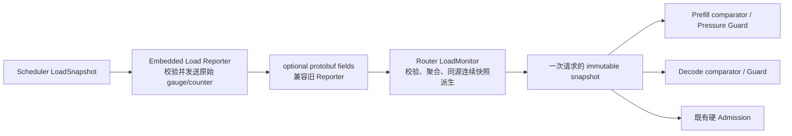

# SGLang Router Policy：Step 3 LoadMonitor 指标接入

日期：2026-08-06
状态：集成分支实现完成，验证通过
范围：`experimental/sgl-router` 与 SGLang Embedded Load Reporter

Step 3 只补齐 LoadMonitor 到 Policy/Guard 的指标链路。Step 1 的顶层 policy、Admission、
Guard 和 P/D 决策顺序不变；Step 2 的 Bucket、SLO 和 fallback 也不变。

## 1. 数据流与边界



协议只传 Scheduler 已有的原始事实。Prefill 处理速率和 Decode step 时间由 Router 对
同一 `source_instance_id` 的连续报告求差，不把 producer 的瞬时估算固化为 wire 契约。
指标缺失、过期、counter reset、source 重启或候选间不可比时只降低比较精度，不能阻塞
推理请求。

## 2. 指标

| Reporter 原始字段 | 类型 | Router 聚合/派生 | 消费位置 |
|---|---|---|---|
| `total_prefill_uncached_tokens` | 连续忙碌 step 的累计 counter | Prefill 吞吐 | Prefill pressure |
| `total_prefill_busy_us` | 连续忙碌 step 的累计 counter | Prefill 吞吐 | Prefill pressure |
| `num_waiting_uncached_tokens` | gauge，既有 | `estimated_prefill_queue_ms` | P2/Session/Cache 的压力比较与 Guard |
| `decode_retracted_queue_reqs` | gauge | endpoint 求和 | Decode 首要压力信号 |
| `decode_prealloc_queue_reqs` | gauge | endpoint 求和 | Decode 待进入队列 |
| `decode_transfer_queue_reqs` | gauge | endpoint 求和 | Decode KV 传输队列 |
| `total_decode_steps` | 累计 counter | `mean_decode_step_ms` | Decode step 压力 |
| `total_decode_step_us` | 累计 counter | `mean_decode_step_ms` | Decode step 压力 |
| `num_active_tokens` | gauge | endpoint 求和 | Decode 活跃 KV 压力 |

Router 派生公式：

```text
prefill_rate_tokens_per_s
  = 1_000_000 * Δtotal_prefill_uncached_tokens / Δtotal_prefill_busy_us

estimated_prefill_queue_ms
  = 1_000 * num_waiting_uncached_tokens / prefill_rate_tokens_per_s

mean_decode_step_ms
  = Δtotal_decode_step_us / Δtotal_decode_steps / 1_000
```

只有 rank 集合一致、counter 单调且本周期存在有效工作量时才发布派生值。多 rank endpoint
对各 rank Prefill rate 求和；Decode step 以总 step 数加权。第一版不做 DP-aware 子 rank
调度，任一 rank 缺少可比 counter 时该 endpoint 的派生值降级为不可用。

Scheduler 会跳过 idle gap 后的首个 Prefill step，因此串行、单 step 的低负载请求可能没有
Prefill rate 样本。这种情况属于正常降级；连续多 step 的忙碌区间才产生 queue-time 估计。

## 3. Policy 与 Guard 如何使用

### 3.1 Prefill

同一候选集全部有 fresh `estimated_prefill_queue_ms` 时，P2、Session backup 选择、
Cache near-tie 比较和 fallback 优先比较 queue time；否则整组统一退化为：

```text
num_waiting_uncached_tokens
→ num_waiting_reqs
→ num_running_reqs
→ Router local active load
```

Pressure Guard 默认保持原 token 阈值。配置
`--pressure-abs-threshold-ms <ms>` 后，只有 primary 和 backup 都有 queue-time 估计时才按
毫秒绝对差与原相对倍率判断；否则自动回退 token guard。该配置只改变软压力逃逸，不改变
Running、Pending 或 KV Admission。`--disable-pressure-guard` 同时关闭 Session pair 和
Cache near-tie 的压力改选。

Cache-Aware 仍先按 `E=L-H` 保留 cache 收益。queue time 只能在既有 near-tie work margin
内改变 winner，不能用轻微负载差抹掉显著 cache 命中。

### 3.2 Decode

Decode 候选的压力比较顺序为：

```text
retracted queue
→ prealloc + transfer queue
→ running / max_running_requests
→ mean_decode_step_ms
→ num_active_tokens / max_total_num_tokens；缺失时使用 num_total_tokens / max_total_num_tokens
→ raw num_running_reqs
→ raw num_active_tokens；缺失时使用 raw num_total_tokens
→ Router local active load
```

详细队列、step time 或 active tokens 只在本次比较的所有候选都具备该层数据时启用，避免
新旧 Reporter 混跑造成非传递排序。旧 Reporter 没有 `num_active_tokens` 时，KV 压力退化为
既有 `num_total_tokens / max_total_num_tokens`。

Decode 硬 Admission 仍只检查 projected running capacity 和 KV/token capacity。Queue、
retraction 与 step time 是动态压力排序，不是新的硬拒绝条件。

## 4. 兼容与故障降级

- 新 protobuf 字段均为 `optional`；旧 Reporter 报告仍可被 Router 接受。
- 只有候选集共同具备 fresh、同精度数据时才使用该精度层。
- 第一个样本、counter reset、producer 重启、rank 集合变化或无新工作时不发布派生值。
- snapshot stale/missing 时沿用 Router local active-load；不会同步查询 Engine。
- 所有计算使用本次请求捕获的不可变 snapshot，不在 comparator 内读取变化中的远端状态。

## 5. 验证要求

- Python：Scheduler 原始字段经 Store、ReportBuilder 和 protobuf 后数值不变；非法 counter
  和结构被拒绝。
- Rust：协议校验、rank 聚合、连续快照派生、reset/restart、旧 Reporter 兼容和候选集
  降级均有测试。
- 跨层：真实派生的 Prefill queue time 能改变 Pressure Guard 决策；Decode queue/step
  指标能改变 Decode Policy 决策。
- 功能验证：真实 Engine counter 在持续 workload 下增长，Router 收到非零 snapshot；派生
  与策略消费由完整 gRPC ingestion 和跨层决策测试验证，请求路径零错误、无 fatal/OOM。
- 收尾：`cargo fmt -- --check`、`cargo clippy --all-targets -- -D warnings`、
  `cargo test --all-targets` 和 Load Reporter Python tests 全部通过。

## 6. 验证结果（2026-08-07）

- H20 8 卡真实 4P+4D、Qwen2.5-7B-Instruct、Mooncake TCP：10/10 请求成功，
  Cache-Aware 同时产生 no-hit 和 hit，LoadMonitor snapshot version 最大为 57。
- 持续 Prefill workload 的真实 counter 增量为 15,681 uncached tokens / 5,196,378 us；
  Decode 增量为 112 steps / 5,620,965 us。请求错误、fatal 和 OOM 均为 0。
- Rust：`fmt`、`clippy -D warnings`、556 个 library tests、4 个 main tests、54 个
  component tests、74 个 proxy tests 和 benchmark harness 全部通过。
- Python：Load Reporter 11 个 tests 与 `py_compile` 通过。
- Prefill queue-time 改变 Guard 决策、Decode queue/step 改变 Decode 选择，均由
  LoadMonitor gRPC ingestion 到 Policy 的跨层测试覆盖；旧 Reporter、counter reset、source
  restart 和字段不完整的降级路径也有测试。

真实功能结果保存在
`/root/router-policy-bench/results/router-v3-step3-pd-functional-r5-20260806`。该验证证明同构
单机 TCP 功能闭环，不等价于异构 Bucket、RDMA 或生产容量结论。

在同一 4P+4D 环境中又完成了 Step 2 baseline 与 Step 3 candidate 的 48-case 成对 A/B，
并为三组高波动 scope 补充 12 个确认 cases。主轮、确认轮和独立 snapshot proof 全部通过，
请求错误、fatal 和 OOM 均为 0。普通 P2 与 hot-prefix 场景基本中性；QPS 8 的 multiturn
Cache 和 Session 场景改善；QPS 12 Session 的 TTFT 仍有高波动回退。完整数值、RSD 和边界见
[Step 3 LoadMonitor A/B 报告](router-policy-step3-monitor-ab-report.md)。
